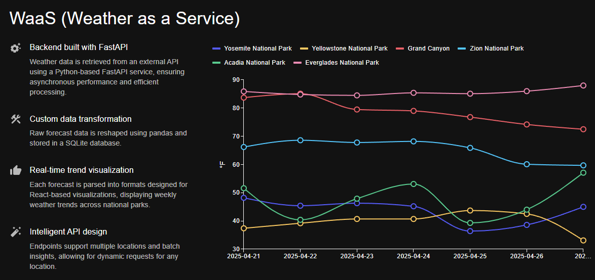
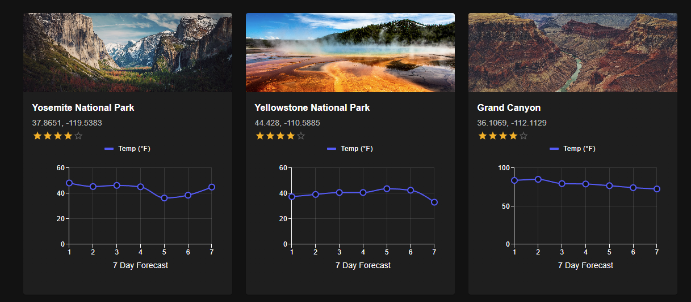
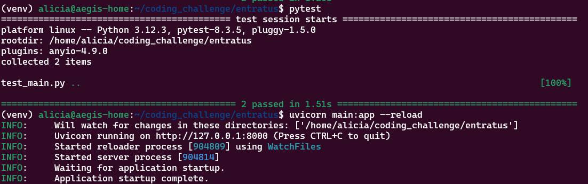
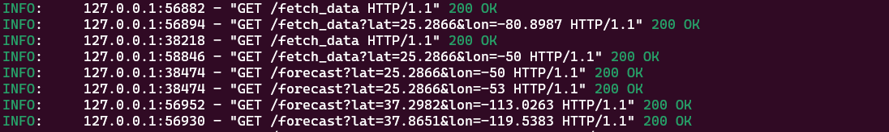

# 🌤️ Entratus Weather Microservice (WaaS — Weather as a Service)

This project is a full-stack async microservice that fetches, transforms, and visualizes 7-day weather forecasts for any location via latitude and longitude. It was built for the Entratus coding challenge to demonstrate full-cycle engineering across API design, async data fetching, data storage, and UI integration.

---

## 🧩 Tech Stack

- **FastAPI** – for the async API layer
- **httpx** – for making non-blocking external requests
- **SQLAlchemy** + **SQLite** – for lightweight persistence
- **pandas** – for processing & transforming temperature data
- **React + MUI + MUI X Charts** – optional front end for visualization
- **pytest** – for testing API behavior

---

## 📁 Project Structure

```
entratus-weather/
├── backend/       # FastAPI service
│   ├── main.py
│   ├── test_main.py
│   ├── requirements.txt
│   └── ...
├── frontend/      # React UI (optional)
│   ├── app/
│   ├── package.json
│   └── ...
├── Makefile       # For convenience (run, test, install)
├── README.md      # You're looking at it
└── .gitignore
```

---
## 📸 Screenshots

### 🔷 UI Dashboard




### 🐍 Terminal Output

Example: Fetching forecast + running tests




---
## 🚀 Getting Started

### 🐍 Backend — FastAPI Microservice

```bash
make venv
make install
make run
```

- Navigate to [http://localhost:8000/docs](http://localhost:8000/docs) to test the API interactively
- Call `/fetch_data?lat=37.8651&lon=-119.5383` to trigger a forecast fetch
- Call `/results` to view the stored logs


#### 📝 FastAPI Aliased Routes

To simplify testing:

- `/fetch_data` is a friendlier alias for `/forecast`, using default lat/lon values
- `/results` is a shortcut to `/logs`, showing recent weather entries


### 🧑‍🎨 Frontend — React UI (Optional)
> 💡 Tip: Run `make run` and `make frontend-run` in separate terminals so both services stay active.

```bash
make frontend-install
make frontend-run
```

- Navigate to [http://localhost:3000](http://localhost:3000) to view the app

> 🧠 Use `--legacy-peer-deps` in install to avoid version resolution issues (already baked into the Makefile)

---

## 🧪 Running Tests

```bash
make test
```

This will run a small `pytest` suite to verify the `/fetch_data` and `/results` endpoints.

---

## 🧠 Notable Features

- **Asynchronous architecture** with full data flow from API → DB → UI
- **Temperature conversion** using pandas to add `temperature_celsius` from raw Fahrenheit
- **Simple logging system** via SQLAlchemy for all fetches
- **Well-documented and fully testable**

---

## ❓ Example API Usage

```bash
curl "http://localhost:8000/fetch_data?lat=25.2866&lon=-80.8987"
curl "http://localhost:8000/results"
```

---

## ✨ Bonus: WaaS (Weather as a Service)

This project includes a full UI built in React + MUI, showing:
- A live weather feed of national parks
- Multi-line + multi-bar chart visualizations
- Consistent async updates using the WaaS (Weather-as-a-Service) API

---

## 🛠 Troubleshooting

> Having issues with `make`? You can run commands manually:

**Backend Setup**

```bash
cd backend
python3 -m venv venv
source venv/bin/activate
pip install -r requirements.txt
uvicorn main:app --reload
```

**Frontend Setup**

```bash
cd frontend
npm install --legacy-peer-deps
npm run dev
```

